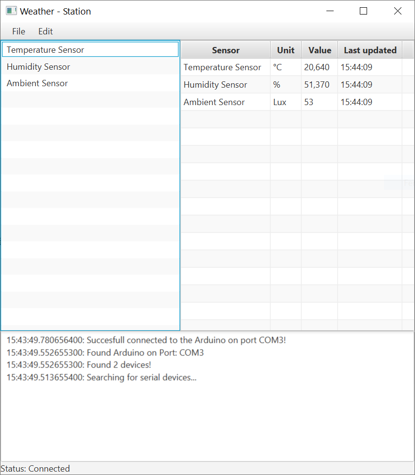

# weather-station

## Issues and feature requests

Bug reports are welcome on the [issue-page](https://github.com/MMartin09/weather-station/issues).
Please make sure to include the steps which lead to the incorrect beahviour. 
If available add the generated crash report or error message. 
Before opening a new issue make sure that there isn't already an open issue with the same problem. 

Feature requests are also welcome. 
But consider checking out if these requests are already [in work](https://github.com/MMartin09/weather-station/issues) to avoid duplication

## Contributions

Community contributions are a welcome addition to the project. 
In order to be merged any additions need to be correctly formatted. 
Before introducing any major features or changes to the application please consider opening an [issue](https://github.com/MMartin09/weather-station/issues) to outline your proposal. 

The project uses [ktlint-gradle](https://github.com/JLLeitschuh/ktlint-gradle) which is based on [ktlint](https://github.com/pinterest/ktlint).
Before opening a PR make sure that the linter passes. 
Use `./gradlew ktlintCheck` or `make ktlint` to run the linter.  
By opening a PR, the continuous integration tests get started. 
These tests include `ktlint`as well. 
